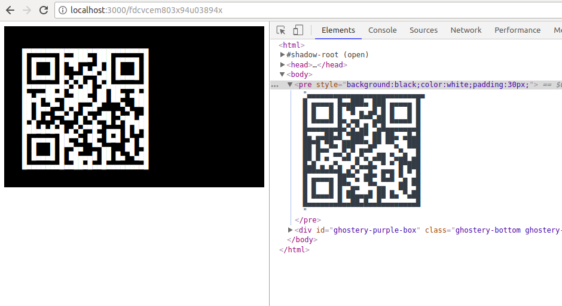
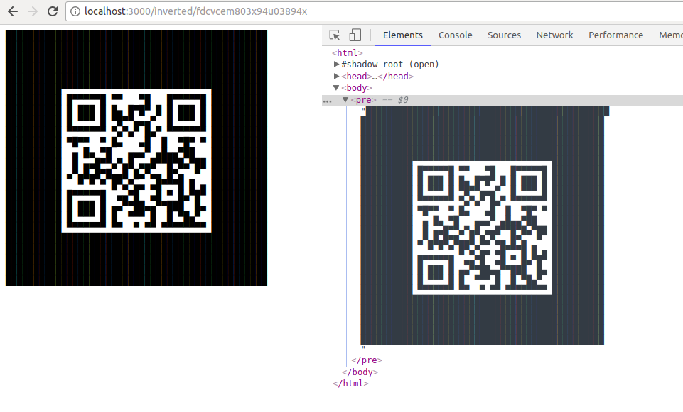
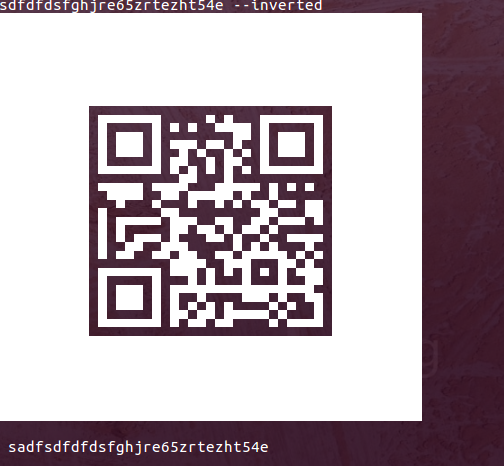

*I was tryng to [send emails with text based qr codes](./assets/screenshot-html.png) 'cause my friends only receive plain text mails, so I generated this small API to generate unicode based QRs*

demo on https://text-to-unicode-qr.herokuapp.com/

this ```curl -GET https://text-to-unicode-qr.herokuapp.com/inverted/sadfsdfdfdsfghjre65zrtezht54e``` will work

## Usage Express WebServer

```
npm run start
```

#### request qr code via API



#### request inverted qr code via API



|API|description|
|---|---|
|/|will return the index.html with input form to convert strings|
|/VALUE|will return the converted VALUE as qr|
|/inverted/VALUE|will return the inverted VALUE as qr|

## Usage CLI

#### request inverted qr code on command line



|argument|description|
|---|---|
|--convertThis|text to be converted|
|--inverted|will invert the qr code|
|--file|will save the qr code in a qr.txt file|
|--file=<VALUE>|will save the qr code in a file named with <VALUE>.txt|

will the converted unicode qr in terminal

```
node ./cli.js --convertThis=sadfsdfdfdsfghjre65zrtezht54e
```

will save a unicode qr in ```./qr.txt```

```
node ./cli.js --convertThis=sadfsdfdfdsfghjre65zrtezht54e --file
```

will save a inverted unicode qr in ```./wurstbrot.txt```

```
node ./cli.js --convertThis=sadfsdfdfdsfghjre65zrtezht54e --inverted --file=wurstbrot
```
