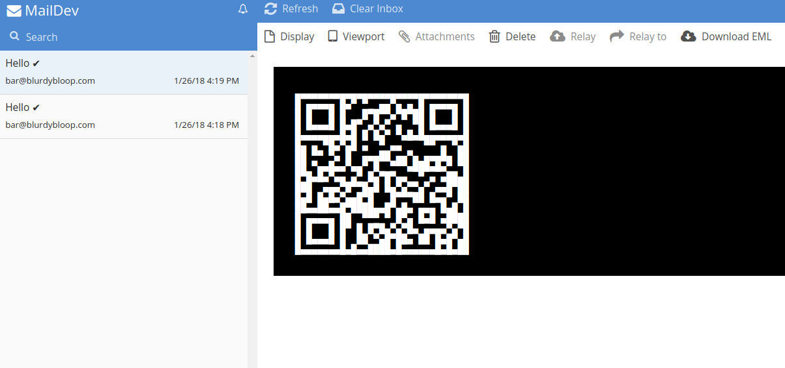

## I try to send emails with text based qr codes


#### QR code via plain text email


#### QR code via HTML email



## Usage

start ```npm run start:maildev```

send a mail with an Bitcoin address as QR code
```node index.js --account 113HP53P3Tcr3BNgj8WHujntdWm3ywCrWa```

goto ```http://0.0.0.0:1080/#/```


## FYI

* need to find out how to format the qr code for 'quoted-printable'
